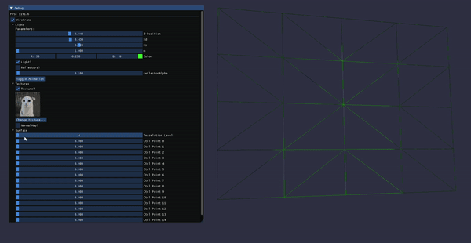

# Bezier Surface

  

An OpenGL app for rendering bezier surface(s). 

# Features
- Render bezier surface(s) and manipulate their control points
- Change texture and normal map of the surface
- Animation of light moving in a spiral pattern
- Three colored togglable reflector lights pointed at the center of the surface
- Render with or without a wireframe
- Manipulate the tesselation level:

